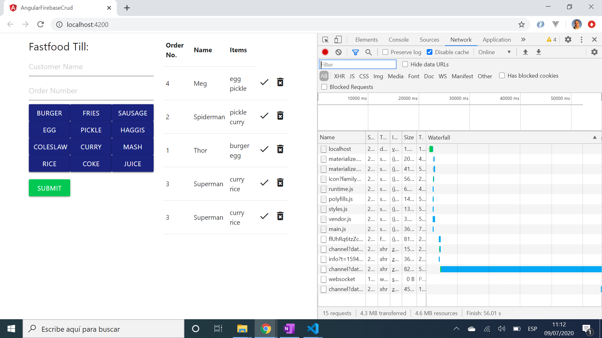

# :zap: Angular Firebase CRUD

* Angular 9 with Firebase to store fast-food orders in a Firebase database. They are then retrieved and shown in a table on-screen

*** Note: to open web links in a new window use: _ctrl+click on link_**

## :books: General info

* Firebase backend stores customer name and number and what they ordered.

## :camera: Screenshots

* 

## :signal_strength: Technologies

* [Angular v9](https://angular.io/) javascript framework
* [Angular Material v9](https://material.angular.io/) component library
* [Angular Material Icons](https://material.io/resources/icons/?style=baseline)
* [Materialize v1](https://materializecss.com/) front-end framework based on Material Design

## :floppy_disk: Setup

* Install dependencies using `npm i`
* Run `ng serve` to get a server at `http://localhost:4200/`
* If required, run `ng build` to build the project. The build artifacts will be stored in the `dist/` directory. Use the `--prod` flag for a production build.

## :computer: Code Examples

* f

```typescript

```

## :cool: Features

* f

## :clipboard: Status & To-Do List

* Status: working - needs improving
* To-Do:  Improve

## :clap: Inspiration

* [Codesourse: Server-side rendering (SSR) in Angular](https://codesource.io/server-side-rendering-in-angular/)

## :envelope: Contact

* Repo created by [ABateman](https://www.andrewbateman.org) - you are welcome to [send me a message](https://andrewbateman.org/contact)
